# 📘 Embedded Systems & IoT
## The Complete Beginner-to-Advanced Guide

<p align="center">
  
  
  
  
  
</p>

<p align="center"><strong>🧠 Learn Electronics → 💻 Program Hardware → 🌐 Connect Devices → 🚀 Build IoT Systems</strong></p>

---

## 📖 About This Book

This repository is a complete beginner-to-advanced learning book for Embedded Systems and IoT. It begins with the basic computer model of input, processing, output, and storage, then builds toward real hardware projects, wireless microcontrollers, Linux single-board computers, cloud connectivity, MQTT messaging, and IoT system design.

Use it as a self-study path, a workshop handout, or a reference while building Arduino, ESP32, and Raspberry Pi projects.

---

## 🗂️ Complete Index

<details>
<summary><strong>📚 Click to expand the complete table of contents</strong></summary>

### 🧠 PART I — FUNDAMENTALS

#### Chapter 1 — Introduction
- [1.1 What is a Computer?](#-11-what-is-a-computer)
- [1.2 What is an Embedded System?](#-12-what-is-an-embedded-system)
- [1.3 What is a Microcontroller?](#-13-what-is-a-microcontroller)
- [1.4 What is a Microprocessor?](#-14-what-is-a-microprocessor)
- [1.5 What is a Microcomputer?](#-15-what-is-a-microcomputer)
- [1.6 MCU vs MPU vs SBC](#-16-mcu-vs-mpu-vs-sbc)

#### Chapter 2 — Inside a Computer
- [2.1 CPU](#-21-cpu)
- [2.2 Clock Speed](#-22-clock-speed)
- [2.3 RAM](#-23-ram)
- [2.4 ROM](#-24-rom)
- [2.5 Flash](#-25-flash)
- [2.6 EEPROM](#-26-eeprom)
- [2.7 Cache](#-27-cache)
- [2.8 Peripherals](#-28-peripherals)

#### Chapter 3 — Electronics Fundamentals
- [3.1 Voltage](#-31-voltage)
- [3.2 Current](#-32-current)
- [3.3 Resistance](#-33-resistance)
- [3.4 Ohm's Law](#-34-ohms-law)
- [3.5 Digital Signals](#-35-digital-signals)
- [3.6 Analog Signals](#-36-analog-signals)
- [3.7 GPIO](#-37-gpio)
- [3.8 Pull-up and Pull-down](#-38-pull-up-and-pull-down)
- [3.9 PWM](#-39-pwm)
- [3.10 ADC](#-310-adc)
- [3.11 DAC](#-311-dac)

#### Chapter 4 — Communication
- [4.1 UART](#-41-uart)
- [4.2 I²C](#-42-i²c)
- [4.3 SPI](#-43-spi)
- [4.4 CAN](#-44-can)
- [4.5 USB](#-45-usb)
- [4.6 Wi-Fi](#-46-wi-fi)
- [4.7 Bluetooth](#-47-bluetooth)

### 🔵 PART II — ARDUINO
- [5.1 What is Arduino?](#-51-what-is-arduino)
- [5.2 Arduino Ecosystem](#-52-arduino-ecosystem)
- [5.3 Arduino Board Architecture](#-53-arduino-board-architecture)
- [5.4 Arduino IDE](#-54-arduino-ide)
- [5.5 Arduino Sketch](#-55-arduino-sketch)
- [6.1 Arduino UNO R3](#-61-arduino-uno-r3)
- [6.2 Arduino Nano](#-62-arduino-nano)
- [6.3 Arduino Leonardo](#-63-arduino-leonardo)
- [6.4 Arduino Micro](#-64-arduino-micro)
- [6.5 Arduino Pro Micro](#-65-arduino-pro-micro)
- [6.6 Arduino Mega](#-66-arduino-mega)
- [6.7 Arduino Due](#-67-arduino-due)
- [6.8 Arduino Zero](#-68-arduino-zero)
- [6.9 Arduino UNO R4](#-69-arduino-uno-r4)
- [6.10 Arduino UNO Q](#-610-arduino-uno-q)
- [7.1 Arduino GPIO](#-71-arduino-gpio)
- [7.2 Arduino PWM](#-72-arduino-pwm)
- [7.3 Arduino ADC](#-73-arduino-adc)
- [7.4 Arduino UART](#-74-arduino-uart)
- [7.5 Arduino I²C](#-75-arduino-i²c)
- [7.6 Arduino SPI](#-76-arduino-spi)
- [7.7 Arduino Interrupts](#-77-arduino-interrupts)
- [7.8 Arduino Timers](#-78-arduino-timers)
- [7.9 Arduino Clock](#-79-arduino-clock)
- [7.10 Arduino Memory](#-710-arduino-memory)
- [8.1 setup()](#-81-setup)
- [8.2 loop()](#-82-loop)
- [8.3 Variables](#-83-variables)
- [8.4 Data Types](#-84-data-types)
- [8.5 Conditions](#-85-conditions)
- [8.6 Loops](#-86-loops)
- [8.7 Functions](#-87-functions)
- [8.8 Libraries](#-88-libraries)
- [8.9 Serial Monitor](#-89-serial-monitor)
- [8.10 Uploading Firmware](#-810-uploading-firmware)

### 🟢 PART III — ESP
- [9.1 What is ESP?](#-91-what-is-esp)
- [9.2 Espressif](#-92-espressif)
- [9.3 ESP vs Arduino](#-93-esp-vs-arduino)
- [10.1 ESP8266 Overview](#-101-esp8266-overview)
- [10.2 ESP8266 Architecture](#-102-esp8266-architecture)
- [10.3 ESP8266 GPIO](#-103-esp8266-gpio)
- [10.4 ESP8266 Wi-Fi](#-104-esp8266-wi-fi)
- [11.1 ESP32 Overview](#-111-esp32-overview)
- [11.2 ESP32 Architecture](#-112-esp32-architecture)
- [11.3 ESP32 GPIO](#-113-esp32-gpio)
- [11.4 ESP32 PWM](#-114-esp32-pwm)
- [11.5 ESP32 ADC](#-115-esp32-adc)
- [11.6 ESP32 DAC](#-116-esp32-dac)
- [11.7 ESP32 UART](#-117-esp32-uart)
- [11.8 ESP32 I²C](#-118-esp32-i²c)
- [11.9 ESP32 SPI](#-119-esp32-spi)
- [11.10 ESP32 Wi-Fi](#-1110-esp32-wi-fi)
- [11.11 ESP32 Bluetooth](#-1111-esp32-bluetooth)
- [11.12 ESP32 Memory](#-1112-esp32-memory)
- [11.13 ESP32 Clock](#-1113-esp32-clock)
- [12.1 ESP32](#-121-esp32)
- [12.2 ESP32-S2](#-122-esp32-s2)
- [12.3 ESP32-S3](#-123-esp32-s3)
- [12.4 ESP32-C2](#-124-esp32-c2)
- [12.5 ESP32-C3](#-125-esp32-c3)
- [12.6 ESP32-C6](#-126-esp32-c6)
- [12.7 ESP32-H2](#-127-esp32-h2)
- [12.8 ESP32-P4](#-128-esp32-p4)

### 🍓 PART IV — RASPBERRY PI
- [13.1 What is Raspberry Pi?](#-131-what-is-raspberry-pi)
- [13.2 Raspberry Pi Computer](#-132-raspberry-pi-computer)
- [13.3 Raspberry Pi vs Microcontroller](#-133-raspberry-pi-vs-microcontroller)
- [13.4 Raspberry Pi Operating System](#-134-raspberry-pi-operating-system)
- [14.1 GPIO](#-141-gpio)
- [14.2 PWM](#-142-pwm)
- [14.3 ADC](#-143-adc)
- [14.4 UART](#-144-uart)
- [14.5 I²C](#-145-i²c)
- [14.6 SPI](#-146-spi)
- [14.7 USB](#-147-usb)
- [14.8 Ethernet](#-148-ethernet)
- [14.9 Wi-Fi](#-149-wi-fi)
- [14.10 Bluetooth](#-1410-bluetooth)
- [15.1 Raspberry Pi 5](#-151-raspberry-pi-5)
- [15.2 Raspberry Pi 4](#-152-raspberry-pi-4)
- [15.3 Raspberry Pi Zero](#-153-raspberry-pi-zero)
- [15.4 Raspberry Pi Compute Module](#-154-raspberry-pi-compute-module)
- [15.5 Raspberry Pi Pico](#-155-raspberry-pi-pico)
- [16.1 Linux](#-161-linux)
- [16.2 Terminal](#-162-terminal)
- [16.3 Python](#-163-python)
- [16.4 GPIO Libraries](#-164-gpio-libraries)
- [16.5 Bash](#-165-bash)
- [16.6 Networking](#-166-networking)

### 🌐 PART V — IoT
- [17.1 What is IoT?](#-171-what-is-iot)
- [17.2 IoT Architecture](#-172-iot-architecture)
- [17.3 IoT Devices](#-173-iot-devices)
- [17.4 Sensors](#-174-sensors)
- [17.5 Actuators](#-175-actuators)
- [18.1 Firmware](#-181-firmware)
- [18.2 Drivers](#-182-drivers)
- [18.3 Libraries](#-183-libraries)
- [18.4 Arduino IDE](#-184-arduino-ide)
- [18.5 ESP-IDF](#-185-esp-idf)
- [18.6 Python](#-186-python)
- [19.1 Wi-Fi](#-191-wi-fi)
- [19.2 HTTP](#-192-http)
- [19.3 REST APIs](#-193-rest-apis)
- [19.4 MQTT](#-194-mqtt)
- [19.5 WebSockets](#-195-websockets)
- [19.6 TCP/IP](#-196-tcpip)
- [20.1 Cloud Computing](#-201-cloud-computing)
- [20.2 IoT Servers](#-202-iot-servers)
- [20.3 Databases](#-203-databases)
- [20.4 Dashboards](#-204-dashboards)
- [20.5 Mobile Applications](#-205-mobile-applications)

### 🛠️ PART VI — PRACTICAL PROJECTS
- [Project 1 — LED Blink](#-project-1--led-blink)
- [Project 2 — Push Button](#-project-2--push-button)
- [Project 3 — Potentiometer + ADC](#-project-3--potentiometer--adc)
- [Project 4 — Ultrasonic Distance Sensor](#-project-4--ultrasonic-distance-sensor)
- [Project 5 — Temperature Sensor](#-project-5--temperature-sensor)
- [Project 6 — Servo Motor](#-project-6--servo-motor)
- [Project 7 — ESP32 Web Server](#-project-7--esp32-web-server)
- [Project 8 — ESP32 IoT Sensor](#-project-8--esp32-iot-sensor)
- [Project 9 — MQTT Sensor](#-project-9--mqtt-sensor)
- [Project 10 — Raspberry Pi IoT Gateway](#-project-10--raspberry-pi-iot-gateway)

</details>

---

---

## 🧠 PART I — FUNDAMENTALS

### 🔹 1.1 What is a Computer?

A computer is a machine that receives input, processes data using stored instructions, optionally stores information, and produces output.

```text
INPUT → PROCESS → OUTPUT
```

A laptop may receive keyboard input and produce screen output. An embedded controller may receive sensor input and produce motor, relay, display, or network output.

```text
Sensor → Microcontroller → Actuator / Display / Network
```

The important idea is not the shape of the device; it is the computing cycle of input, processing, memory, and output.

### 🔹 1.2 What is an Embedded System?

An embedded system is a computer built into a larger product to perform a focused task. It is usually optimized for cost, power, size, reliability, and predictable behavior rather than general-purpose desktop computing.

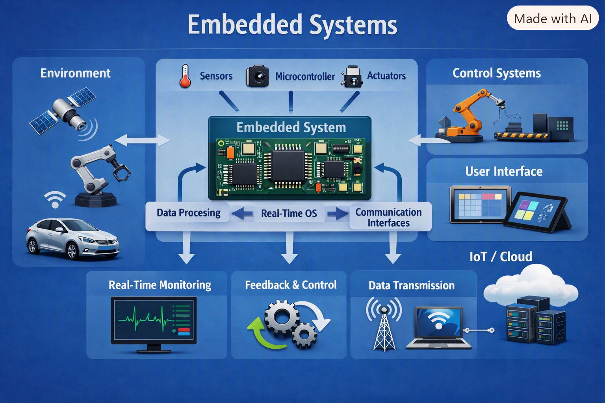

Examples include washing-machine controllers, car ECUs, drone flight controllers, printer control boards, smart thermostats, medical instruments, traffic lights, and industrial sensors.

Typical parts are a processor, firmware, memory, input sensors, output actuators, communication interfaces, and a power supply.

### 🔹 1.3 What is a Microcontroller?

A microcontroller, or MCU, is a small computer integrated into one chip. It usually contains CPU, RAM, flash memory, timers, GPIO, ADC, PWM, and serial communication peripherals.

```text
┌──────────────────────────────────┐
│        MICROCONTROLLER           │
│ CPU │ RAM │ FLASH │ EEPROM       │
│ GPIO│ ADC │ PWM   │ UART/SPI/I²C │
└──────────────────────────────────┘
```

MCUs are excellent for real-time control because firmware can directly manipulate hardware pins with very low latency. Common examples include ATmega328P, ATmega2560, ATmega32U4, RP2040, ESP32, STM32, and Renesas RA4M1.

### 🔹 1.4 What is a Microprocessor?

A microprocessor, or MPU, is primarily a CPU. It normally needs external RAM, storage, power management, and I/O controller chips to form a complete system.

```text
          ┌──────────────┐
          │ MICROPROCESSOR│
          │     CPU      │
          └───────┬──────┘
                  │
       RAM ───────┼────── Storage
                  │
                 I/O
```

MPUs are common in laptops, desktops, phones, tablets, and Linux-capable embedded systems. They provide much higher application performance than small MCUs but usually consume more power and have longer boot times.

### 🔹 1.5 What is a Microcomputer?

A microcomputer is a complete computer built around a microprocessor or system-on-chip. A single-board computer, or SBC, is a microcomputer implemented on one board.

A Raspberry Pi is a common SBC. It includes CPU/SoC, RAM, storage interface, USB, networking, display output, audio, and GPIO. Unlike a typical Arduino, it can run Linux and multiple applications at the same time.

### 🔹 1.6 MCU vs MPU vs SBC


| Feature | Microcontroller | Microprocessor | SBC / Microcomputer |
|---|---|---|---|
| Integration | CPU + memory + peripherals | CPU-focused | Complete board-level computer |
| RAM | Usually integrated | Usually external | Large board memory |
| Storage | Internal flash or external flash | External | microSD/eMMC/NVMe/USB |
| GPIO | Built in | Usually via controllers | Usually exposed on header |
| Operating system | Usually bare-metal or RTOS | Usually OS-based | Linux-capable |
| Boot time | Very fast | Longer | Longer |
| Power | Very low | Medium/high | Medium/high |
| Real-time behavior | Excellent | Depends on system | OS-dependent |
| Example | Arduino, ESP32, STM32 | ARM Cortex-A CPU | Raspberry Pi |

### 🔹 2.1 CPU

CPU means Central Processing Unit. It fetches instructions from memory, decodes them, executes arithmetic or control operations, and stores results.

```text
Instruction → Fetch → Decode → Execute → Store Result
```

Important CPU concepts include registers, arithmetic logic unit, control logic, instruction set, interrupt handling, pipeline depth, and power modes.

### 🔹 2.2 Clock Speed

Clock speed is the rate at which a processor's clock ticks. A 16 MHz MCU has about 16 million clock cycles per second. Clock speed matters, but it is not the only performance measure. Architecture, instruction efficiency, memory wait states, cache, bus speed, compiler optimization, and peripheral hardware can make two processors at the same clock perform very differently.

### 🔹 2.3 RAM

RAM, or Random Access Memory, stores temporary data while code runs. Variables, buffers, stacks, heaps, and runtime state often live in RAM.

```cpp
int temperature = 25;
```

RAM is volatile, so contents are lost when power is removed. Small MCUs may have only a few kilobytes, so careful buffer sizing matters.

### 🔹 2.4 ROM

ROM means Read-Only Memory. Historically it described memory permanently programmed at manufacture. In modern embedded discussions, people may use ROM broadly for non-volatile program memory, boot ROM, or factory-programmed code. Boot ROM is important because it can contain startup code that loads firmware from flash.

### 🔹 2.5 Flash

Flash is non-volatile memory that commonly stores firmware, constants, and filesystems.

```text
FLASH
├── Bootloader
├── Application firmware
├── Constants
└── Files / partitions
```

Flash survives power loss but has limited erase/write cycles. Firmware updates, OTA partitions, and configuration storage must account for flash wear.

### 🔹 2.6 EEPROM

EEPROM is electrically erasable non-volatile memory used for small persistent data such as calibration values, counters, serial numbers, and user settings. Some MCUs have true EEPROM; others emulate EEPROM using flash. Because write endurance is finite, avoid writing EEPROM repeatedly in tight loops.

### 🔹 2.7 Cache

Cache is fast memory close to the CPU. It stores recently used instructions or data to reduce slow memory access.

```text
CPU → L1 Cache → L2 Cache → RAM → Storage
```

Caches improve performance on MPUs and advanced MCUs, but they can complicate DMA, real-time timing, and memory coherency.

### 🔹 2.8 Peripherals

A peripheral is a hardware block attached to the processor. Common embedded peripherals include GPIO, ADC, DAC, PWM, UART, SPI, I²C, CAN, USB, timers, RTC, watchdogs, DMA, I²S, camera interfaces, Ethernet MACs, Wi-Fi radios, and Bluetooth radios. Peripherals let firmware interact with the physical world efficiently.

### 🔹 3.1 Voltage

Voltage is electrical potential difference, often compared to pressure in a water system. Embedded devices commonly use 1.8 V, 3.3 V, 5 V, 12 V, or battery voltages. Always match logic levels: a 5 V signal can damage a 3.3 V-only input.

### 🔹 3.2 Current

Current is the flow of electric charge measured in amperes. GPIO pins can provide only small currents, while motors, heaters, relays, and LED strips need drivers or separate supplies. Exceeding pin current ratings can permanently damage a board.

### 🔹 3.3 Resistance

Resistance opposes current flow and is measured in ohms. Resistors are used for current limiting, voltage dividers, pull-up/pull-down networks, filtering with capacitors, and sensing. LED circuits commonly include a resistor to limit current.

### 🔹 3.4 Ohm's Law

Ohm's Law links voltage, current, and resistance.

```text
V = I × R
I = V / R
R = V / I
```

If a 5 V supply drives a 1 kΩ resistor, current is 5 / 1000 = 0.005 A = 5 mA.

### 🔹 3.5 Digital Signals

Digital signals use discrete logic levels. LOW is near ground and HIGH is near the logic supply, but exact thresholds depend on the device. Digital inputs must not float; they should be driven high, low, or held with pull resistors.

### 🔹 3.6 Analog Signals

Analog signals vary continuously. A temperature sensor might output 0.5 V, 1.2 V, or 2.8 V. MCUs read analog signals using ADCs, but the signal must stay within the allowed input range and may need filtering or scaling.

### 🔹 3.7 GPIO

GPIO means General Purpose Input/Output. Pins can read buttons, switches, and digital sensors, or drive LEDs, chip-select lines, transistor gates, and control signals. GPIO modes commonly include input, output, pull-up, pull-down, open-drain, and alternate functions.

### 🔹 3.8 Pull-up and Pull-down

A floating input can randomly read HIGH or LOW. A pull-up resistor connects a signal weakly to VCC; a pull-down connects it weakly to GND. Many MCUs have internal pull resistors, which simplify button wiring.

### 🔹 3.9 PWM

PWM, or Pulse Width Modulation, rapidly switches a digital signal to control average power. The duty cycle is ON time divided by period. PWM controls LED brightness, motor speed through drivers, buzzers, and servo control pulses.

### 🔹 3.10 ADC

ADC means Analog-to-Digital Converter. It converts voltage to a number. A 10-bit ADC has 1024 levels; a 12-bit ADC has 4096 levels. Accuracy depends on reference voltage, input impedance, noise, sampling time, calibration, and PCB layout.

### 🔹 3.11 DAC

DAC means Digital-to-Analog Converter. It converts a digital number into an analog voltage. DACs are useful for waveform generation, audio, analog control, calibration sources, and test signals. Not every MCU includes a DAC.

### 🔹 4.1 UART

UART is asynchronous serial communication. It usually uses TX, RX, and GND. Both devices must agree on baud rate, data bits, parity, and stop bits.

```text
Device A TX → Device B RX
Device A RX ← Device B TX
Device A GND ↔ Device B GND
```

### 🔹 4.2 I²C

I²C uses SDA and SCL lines with pull-up resistors. Many devices can share the same bus if addresses do not conflict. It is popular for sensors, RTCs, EEPROMs, and small displays.

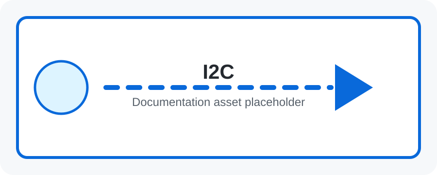

### 🔹 4.3 SPI

SPI uses MOSI, MISO, SCK, and a chip-select line for each device. It is fast and full-duplex, making it useful for displays, SD cards, external flash, ADCs, DACs, and high-speed sensors.

### 🔹 4.4 CAN

CAN, or Controller Area Network, is a robust multi-node bus used in automotive, robotics, and industrial control. Nodes share a differential bus and messages include identifiers for arbitration and filtering.

### 🔹 4.5 USB

USB can provide power, programming, serial communication, mass storage, HID devices, cameras, audio, and networking. Some boards use USB-to-serial chips, while others have native USB built into the MCU.

### 🔹 4.6 Wi-Fi

Wi-Fi connects devices to a local network and the Internet. It enables web servers, HTTP APIs, MQTT clients, OTA updates, dashboards, and cloud telemetry. It uses more power than simple wired buses, so power planning matters.

### 🔹 4.7 Bluetooth

Bluetooth supports short-range wireless communication. Bluetooth Classic is common for audio and serial-like links; Bluetooth Low Energy is common for sensors, beacons, mobile app control, wearables, and battery-powered devices.

### 🔹 5.1 What is Arduino?

Arduino is an open-source electronics ecosystem combining development boards, the Arduino IDE, libraries, examples, documentation, and a large community. It makes embedded programming accessible by hiding much low-level setup while still teaching real hardware concepts.

### 🔹 5.2 Arduino Ecosystem

The Arduino ecosystem includes boards, shields, libraries, IDE tooling, board cores, examples, and community projects. A typical workflow is write code, select board, select port, compile, upload, and observe behavior with LEDs, sensors, actuators, or Serial Monitor.

### 🔹 5.3 Arduino Board Architecture


A typical board includes USB/programming circuitry, a microcontroller, voltage regulation, clock source, reset circuit, headers, GPIO, analog inputs, PWM pins, and serial buses. The board converts a raw MCU into a beginner-friendly development platform.

### 🔹 5.4 Arduino IDE

The Arduino IDE lets you edit sketches, install board packages, manage libraries, compile code, upload firmware, and view serial output. It is often the easiest first tool for Arduino, ESP8266, and ESP32 learning.

### 🔹 5.5 Arduino Sketch

An Arduino program is called a sketch. Every sketch usually has `setup()` for one-time initialization and `loop()` for repeated behavior.

```cpp
void setup() {
    pinMode(LED_BUILTIN, OUTPUT);
}

void loop() {
    digitalWrite(LED_BUILTIN, HIGH);
    delay(1000);
    digitalWrite(LED_BUILTIN, LOW);
    delay(1000);
}
```

### 🔹 6.1 Arduino UNO R3

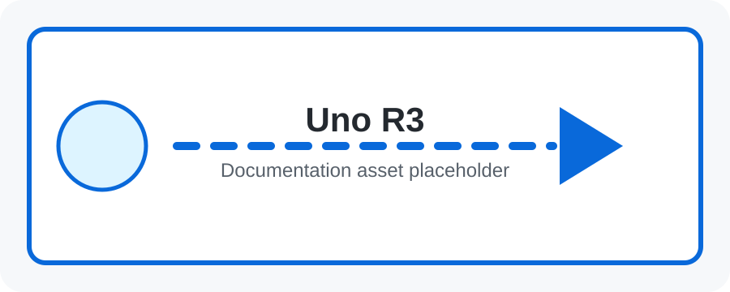

ATmega328P, 16 MHz, 5 V logic, 14 digital I/O, 6 PWM, 6 analog inputs, 10-bit ADC, 32 KB flash, 2 KB SRAM, and 1 KB EEPROM. It is the classic beginner board and a strong baseline for learning GPIO, ADC, PWM, UART, SPI, and I²C.

### 🔹 6.2 Arduino Nano

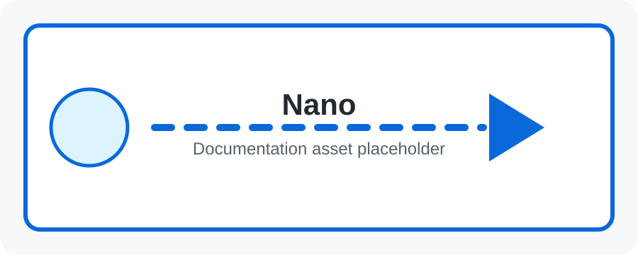

A compact ATmega328P board similar to the UNO but breadboard-friendly. It is useful when size matters and USB programming is still desired. Nano boards often expose more analog pins than the UNO form factor.

### 🔹 6.3 Arduino Leonardo

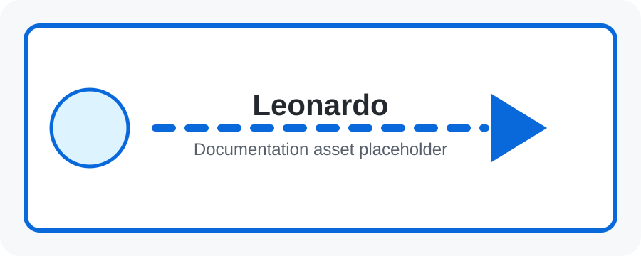

Uses the ATmega32U4 with native USB. Native USB lets the board act as a keyboard, mouse, joystick, or custom USB device without a separate USB-to-serial chip.

---

## 🔵 PART II — ARDUINO

### 🔹 6.4 Arduino Micro

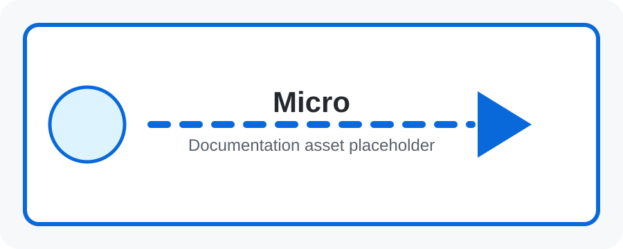

A compact ATmega32U4 board with native USB. It is useful for USB HID projects, small controllers, and projects that need Leonardo-like features in a smaller package.

### 🔹 6.5 Arduino Pro Micro

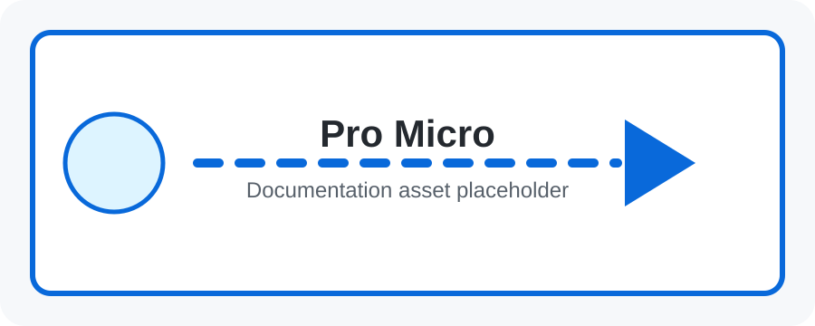

A small ATmega32U4-compatible board widely used in custom keyboards, game controllers, and compact USB devices. Pinout and voltage variants differ by manufacturer, so always check the specific board.

### 🔹 6.6 Arduino Mega

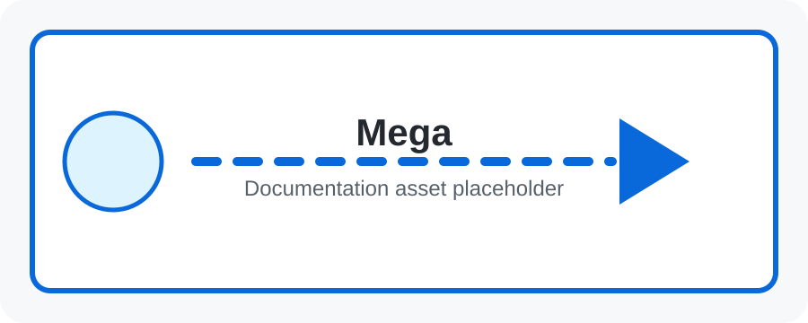

Uses the ATmega2560 with 54 digital I/O, 15 PWM pins, 16 analog inputs, 256 KB flash, 8 KB SRAM, 4 KB EEPROM, and 4 hardware UARTs. It is useful when many pins or serial ports are needed.

### 🔹 6.7 Arduino Due


A 32-bit ARM Cortex-M3 board based on the SAM3X8E. It runs at 84 MHz and uses 3.3 V logic, so level compatibility matters when connecting 5 V modules.

### 🔹 6.8 Arduino Zero


A 32-bit ARM Cortex-M0+ board designed for more advanced embedded applications than classic AVR boards. It provides modern debugging and improved processing capability.

### 🔹 6.9 Arduino UNO R4

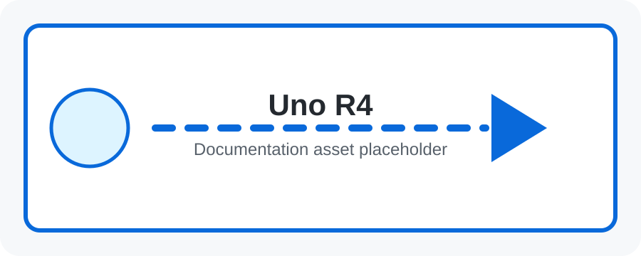

The UNO R4 family uses a Renesas RA4M1 32-bit MCU. It offers more memory, better performance, and modern peripherals while keeping the familiar UNO form factor.

### 🔹 6.10 Arduino UNO Q

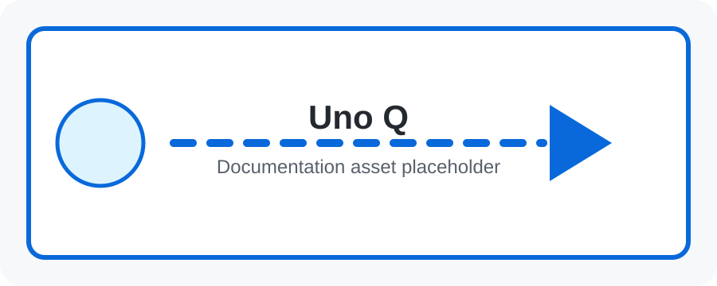

A newer Arduino platform aimed at advanced hardware/software applications such as AI, robotics, edge workflows, Linux-based development, and connected systems. Treat it as a bridge between classic Arduino learning and more complex edge computing.

### 🔹 7.1 Arduino GPIO

Arduino GPIO can be configured as inputs, outputs, or inputs with internal pull-ups.

```cpp
pinMode(13, OUTPUT);
digitalWrite(13, HIGH);
pinMode(2, INPUT_PULLUP);
int value = digitalRead(2);
```

### 🔹 7.2 Arduino PWM

`analogWrite()` outputs PWM on supported pins. On classic UNO, PWM pins include 3, 5, 6, 9, 10, and 11. Values commonly range from 0 to 255, where 128 is about 50% duty cycle.

### 🔹 7.3 Arduino ADC

`analogRead()` reads analog input pins. On classic UNO, A0 through A5 feed a 10-bit ADC with values from 0 to 1023.

```cpp
int sensorValue = analogRead(A0);
```

### 🔹 7.4 Arduino UART

Arduino exposes UART through `Serial`. It is used for debugging, communicating with modules, and sending measurements to a computer.

```cpp
void setup() { Serial.begin(9600); }
void loop() { Serial.println("Hello!"); delay(1000); }
```

### 🔹 7.5 Arduino I²C

Arduino uses the `Wire` library for I²C.

```cpp
#include <Wire.h>
void setup() { Wire.begin(); }
```

Use I²C for sensors, OLEDs, RTC modules, and expanders.

### 🔹 7.6 Arduino SPI

Arduino uses the `SPI` library for SPI devices.

```cpp
#include <SPI.h>
void setup() { SPI.begin(); }
```

SPI is common for SD cards, displays, external flash, and high-speed converters.

### 🔹 7.7 Arduino Interrupts

Interrupts let firmware respond immediately to external events. Keep interrupt service routines short and use `volatile` variables for data shared with the main loop.

```cpp
volatile bool triggered = false;
void isr() { triggered = true; }
void setup() { attachInterrupt(digitalPinToInterrupt(2), isr, FALLING); }
```

### 🔹 7.8 Arduino Timers

Timers generate PWM, measure time, count pulses, schedule periodic events, and support libraries such as Servo. Changing timer configuration can affect `delay()`, `millis()`, PWM frequencies, or libraries depending on the board.

### 🔹 7.9 Arduino Clock

Classic UNO runs at 16 MHz, Due at 84 MHz, and UNO R4 uses a faster modern MCU clock. Clock source and frequency affect serial timing, delay functions, PWM, power consumption, and maximum instruction throughput.

### 🔹 7.10 Arduino Memory

UNO R3 has 32 KB flash, 2 KB SRAM, and 1 KB EEPROM. Flash stores program code, SRAM stores runtime variables, and EEPROM stores persistent settings. Large strings and arrays can quickly consume SRAM on small boards.

### 🔹 8.1 setup()

`setup()` runs once after reset. Use it to configure pin modes, start serial communication, initialize sensors, connect to networks, and prepare state.

### 🔹 8.2 loop()

`loop()` runs repeatedly. It should read inputs, update state, control outputs, communicate, and avoid unnecessary blocking in responsive projects.

### 🔹 8.3 Variables

Variables store values.

```cpp
int temperature = 25;
float voltage = 3.3;
bool enabled = true;
char letter = 'A';
```

### 🔹 8.4 Data Types

Common Arduino/C++ types include `bool`, `char`, `byte`, `int`, `long`, `float`, `double`, `String`, arrays, structs, and enums. Exact sizes can vary by architecture, especially between 8-bit AVR and 32-bit boards.

### 🔹 8.5 Conditions

Conditions choose behavior.

```cpp
if (temperature > 30) {
    Serial.println("HOT");
} else {
    Serial.println("NORMAL");
}
```

### 🔹 8.6 Loops

Loops repeat work. Use `for` loops for known counts and `while` loops for condition-based repetition.

```cpp
for (int i = 0; i < 10; i++) { Serial.println(i); }
```

### 🔹 8.7 Functions

Functions organize code into reusable actions.

```cpp
void turnLEDOn() { digitalWrite(13, HIGH); }
```

### 🔹 8.8 Libraries

Libraries package reusable code for sensors, displays, motors, networking, storage, and protocols. Install libraries through Library Manager or add them to the project depending on the workflow.

### 🔹 8.9 Serial Monitor

Serial Monitor displays text sent by the board and can send input back. It is essential for debugging sensor readings, state transitions, network events, and error messages.

### 🔹 8.10 Uploading Firmware

Firmware upload flow: write sketch, verify/compile, select board, select port, upload through bootloader or programmer, reset, and run from flash. Upload failures often come from wrong board, wrong port, missing driver, or boot mode issues.

### 🔹 9.1 What is ESP?

ESP refers to Espressif wireless MCUs and SoCs, especially ESP8266 and ESP32. They combine processing, GPIO, communication peripherals, and wireless networking for low-cost connected devices.

### 🔹 9.2 Espressif

Espressif designs chips, modules, SDKs, and development frameworks for connected embedded products. Its ecosystem includes ESP-IDF, Arduino cores, documentation, modules, reference boards, and security features.

### 🔹 9.3 ESP vs Arduino

Classic Arduino UNO is ideal for simple control and beginner wiring. ESP32 adds built-in Wi-Fi, Bluetooth on supported variants, higher clock speeds, more memory, and stronger IoT capability, but it also has more bootstrapping, power, and pin-mapping considerations.

### 🔹 10.1 ESP8266 Overview

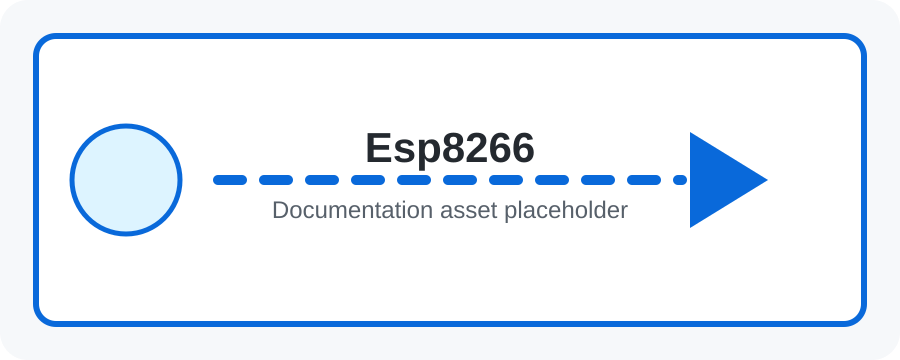

ESP8266 made low-cost Wi-Fi projects popular. Boards include NodeMCU, Wemos D1 Mini, and ESP-01. It can run web servers, MQTT clients, HTTP clients, and smart-device firmware.

**Practical ESP8266 details:**

| Area | What to remember |
|---|---|
| Best use | Low-cost Wi-Fi sensors, switches, MQTT nodes, small web servers, and retrofits |
| Power | Needs a stable 3.3 V supply; Wi-Fi transmit bursts can reset weak supplies |
| Boot pins | Some GPIO pins affect boot mode, so avoid pulling them to the wrong level at reset |
| Pin labels | Dev-board labels such as D1/D2 often differ from raw GPIO numbers |
| ADC | Many modules expose limited analog input capability; check board scaling before applying voltage |
| Firmware options | Arduino core, ESP8266 RTOS SDK, MicroPython, AT firmware, or custom C/C++ firmware |

A good first ESP8266 path is: blink an LED, connect to Wi-Fi, serve a local page, publish MQTT telemetry, then add OTA update support.

### 🔹 10.2 ESP8266 Architecture

ESP8266 integrates CPU, Wi-Fi radio, GPIO, UART, SPI, timers, and memory interfaces. Many development boards add USB-to-serial, voltage regulation, reset, and boot buttons.

A typical ESP8266 development board is more than the chip itself:

```text
USB Port → USB-to-Serial → ESP8266 Module → GPIO / Sensors / Relays
                 │              │
             Boot/Reset      3.3 V Regulator
```

The module usually contains the ESP8266 SoC, RF circuitry, antenna, external flash, shielding, and castellated or header pins. The development board adds the hardware that makes it easy to power, program, and reset.

### 🔹 10.3 ESP8266 GPIO

ESP8266 GPIO is useful but boot-strapping pins and board labels can be confusing. Board labels like D1 or D2 may not match raw GPIO numbers. Always check the exact board pinout before wiring relays, sensors, or displays.

**GPIO checklist:**

- Avoid pins that must be HIGH or LOW during boot unless the connected circuit preserves the boot state.
- Use a transistor, MOSFET, optocoupler, or relay driver board for loads that exceed GPIO current capability.
- Add flyback diodes or proper driver modules for coils, relays, and motors.
- Keep sensor wires short or add filtering/pull resistors for noisy environments.
- Treat all GPIO as 3.3 V logic unless the board documentation explicitly says otherwise.

### 🔹 10.4 ESP8266 Wi-Fi

ESP8266 can connect to routers as a station, create an access point, serve web pages, call HTTP APIs, publish MQTT messages, and receive OTA updates. Wi-Fi current spikes mean stable 3.3 V power is important.

Common Wi-Fi patterns:

| Pattern | Description |
|---|---|
| Station mode | ESP8266 joins an existing router and talks to local/cloud services |
| Access point mode | ESP8266 creates a setup network for provisioning or local control |
| Web server | Browser sends HTTP requests directly to the device |
| MQTT client | Device publishes telemetry and subscribes to commands through a broker |
| Deep-sleep sensor | Device wakes, measures, transmits, and sleeps to save battery |

### 🔹 11.1 ESP32 Overview

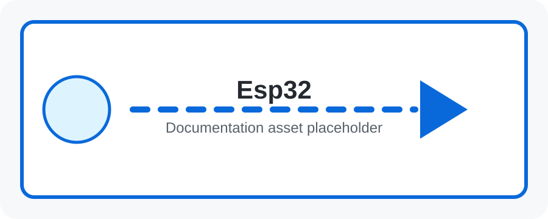

ESP32 is a family of connected SoCs with 32-bit processing, Wi-Fi, Bluetooth on supported variants, GPIO, ADC, PWM, UART, SPI, I²C, timers, and deep-sleep support.

---

## 🟢 PART III — ESP

### 🔹 11.2 ESP32 Architecture

ESP32 architecture combines CPU cores, SRAM, flash interface, radio subsystem, RTC domain, GPIO matrix, timers, ADC, communication peripherals, and security hardware. Many functions can be routed to flexible pins through the GPIO matrix.

### 🔹 11.3 ESP32 GPIO

ESP32 pins can serve as digital I/O, ADC inputs, touch inputs on supported chips, PWM outputs, serial buses, and wake-up sources. Some pins are input-only, reserved for flash, or tied to boot modes.

### 🔹 11.4 ESP32 PWM

ESP32 commonly uses the LEDC peripheral for PWM. It supports configurable frequency and resolution and can control LEDs, motors through drivers, buzzers, dimmers, and servo-like signals.

### 🔹 11.5 ESP32 ADC

ESP32 ADC behavior varies across chips. Consider input attenuation, calibration, nonlinearity, Wi-Fi interactions on some variants, input-only pins, and valid voltage range.

### 🔹 11.6 ESP32 DAC

Some ESP32 variants include DAC outputs for basic analog voltages, audio experiments, and waveform generation. Not every ESP32-family chip has DAC channels, so verify the specific datasheet.

### 🔹 11.7 ESP32 UART

ESP32 devices provide multiple UART controllers depending on variant. UART is useful for debug logs, GPS modules, modems, serial sensors, and MCU-to-MCU communication.

### 🔹 11.8 ESP32 I²C

ESP32 supports I²C for sensors, displays, RTCs, expanders, and EEPROMs. Pins are often configurable, but pull-up resistors and suitable bus speed are still required.

### 🔹 11.9 ESP32 SPI

ESP32 SPI can connect displays, SD cards, flash, ADCs, and high-speed sensors. Some SPI buses may be used internally for flash or PSRAM, so choose external pins carefully.

### 🔹 11.10 ESP32 Wi-Fi

ESP32 Wi-Fi supports station and access point use cases. It enables provisioning portals, REST APIs, MQTT telemetry, local dashboards, cloud integrations, OTA updates, and device discovery.

### 🔹 11.11 ESP32 Bluetooth

Bluetooth support depends on chip family. Original ESP32 supports Bluetooth Classic and BLE; many newer variants focus on BLE. BLE is useful for provisioning, sensors, and phone apps.

### 🔹 11.12 ESP32 Memory

ESP32 systems include internal SRAM, external flash, RTC memory, and optional PSRAM on some modules. Memory planning matters for web servers, TLS, camera buffers, ML workloads, and OTA partitions.

### 🔹 11.13 ESP32 Clock

Clock architecture depends on chip and power mode. Common operating speeds include 160 MHz and 240 MHz on original ESP32-class devices, while low-power modes use RTC clocks.

### 🔹 12.1 ESP32

Original ESP32 is a general-purpose Wi-Fi and Bluetooth SoC for IoT, robotics, controls, dashboards, and connected sensors.

### 🔹 12.2 ESP32-S2

ESP32-S2 focuses on Wi-Fi and USB without the same Bluetooth feature set as original ESP32. It is useful for USB-enabled Wi-Fi products.

### 🔹 12.3 ESP32-S3

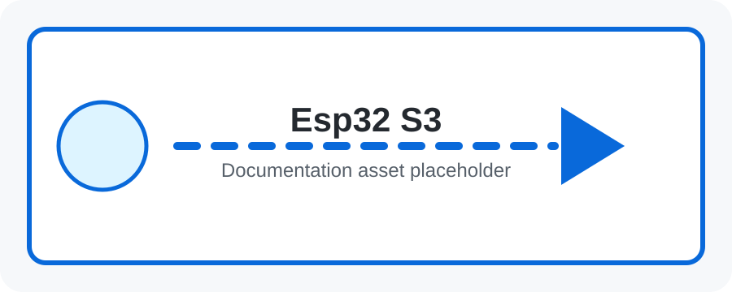

ESP32-S3 adds Wi-Fi, BLE, USB, and vector instructions useful for AI/ML-style edge tasks, voice, vision, and human-machine interfaces.

### 🔹 12.4 ESP32-C2

ESP32-C2 is a cost-focused option for simple connected sensors, switches, and low-cost IoT products.

### 🔹 12.5 ESP32-C3

ESP32-C3 uses a RISC-V core and supports Wi-Fi and BLE, making it popular for compact secure IoT devices.

### 🔹 12.6 ESP32-C6

ESP32-C6 targets newer networks with Wi-Fi 6, BLE, and 802.15.4, useful for modern smart-home and Matter/Thread-style ecosystems.

### 🔹 12.7 ESP32-H2

ESP32-H2 focuses on BLE and 802.15.4 instead of Wi-Fi, making it useful for low-power mesh and smart-home devices.

### 🔹 12.8 ESP32-P4

ESP32-P4 is aimed at higher-performance embedded processing for displays, vision, HMI, and compute-heavy embedded workloads; pair it with connectivity where needed.

### 🔹 13.1 What is Raspberry Pi?

Raspberry Pi is a family of small computers and microcontroller boards. Raspberry Pi computers run Linux; Raspberry Pi Pico-class boards run microcontroller firmware.

### 🔹 13.2 Raspberry Pi Computer

A Raspberry Pi computer includes a SoC, RAM, storage interface, USB, display output, networking on many models, GPIO, and Linux software support. It can run multiple processes, servers, databases, and development tools.

### 🔹 13.3 Raspberry Pi vs Microcontroller

Raspberry Pi is best when you need Linux, Python, camera support, networking, databases, AI, or a web server. Microcontrollers are better for low power, instant boot, deterministic control, and simple sensor/actuator tasks.

### 🔹 13.4 Raspberry Pi Operating System

Raspberry Pi OS and other Linux distributions provide kernel drivers, filesystems, user accounts, networking, package management, services, and application environments.

### 🔹 14.1 GPIO

Raspberry Pi GPIO uses 3.3 V logic and can read inputs or drive outputs. Never apply 5 V directly to GPIO. Libraries such as gpiozero simplify pin control.

### 🔹 14.2 PWM

PWM on Raspberry Pi can be hardware-based on selected pins or software-based through libraries. It is useful for LED dimming, motor driver control, and servo experiments.

### 🔹 14.3 ADC

Typical Raspberry Pi computers do not include general-purpose analog inputs. Use external ADC chips such as MCP3008 over SPI or ADS1115 over I²C for analog sensors.

### 🔹 14.4 UART

Pi UART connects to serial devices, microcontrollers, GPS modules, and debug consoles. Ensure voltage levels match and enable/configure serial interfaces in the OS as needed.

---

## 🍓 PART IV — RASPBERRY PI

### 🔹 14.5 I²C

Pi I²C commonly connects sensors, OLED displays, RTC modules, ADCs, and I/O expanders. Enable I²C in system settings and use tools such as `i2cdetect` for diagnostics.

### 🔹 14.6 SPI

Pi SPI connects displays, ADCs, DACs, radio modules, and SD-like peripherals. Enable SPI and wire MOSI, MISO, SCLK, CE, 3.3 V, and GND carefully.

### 🔹 14.7 USB

USB supports keyboards, mice, storage, serial adapters, cameras, audio, network adapters, and microcontroller programming cables.

### 🔹 14.8 Ethernet

Ethernet provides reliable wired networking for gateways, servers, dashboards, and industrial deployments where Wi-Fi may be unstable.

### 🔹 14.9 Wi-Fi

Wi-Fi enables untethered networking, SSH, dashboards, cloud communication, and local APIs. Headless deployments often configure Wi-Fi before first boot.

### 🔹 14.10 Bluetooth

Bluetooth supports controllers, phones, BLE sensors, audio devices, and local provisioning workflows depending on model and OS support.

### 🔹 15.1 Raspberry Pi 5


Raspberry Pi 5 is suitable for Linux learning, servers, robotics, camera work, AI, computer vision, dashboards, and IoT gateway applications.

**Raspberry Pi 5 details:**

| Feature | Detail |
|---|---|
| Processor | Broadcom BCM2712 quad-core Arm Cortex-A76 64-bit CPU at 2.4 GHz |
| Memory | LPDDR4X variants up to 16 GB |
| I/O controller | RP1 I/O controller designed by Raspberry Pi |
| Display | Dual 4Kp60 HDMI output with HDR support |
| Expansion | PCIe 2.0 x1 interface for fast peripherals through an adapter/HAT |
| USB | 2 × USB 3.0 and 2 × USB 2.0 |
| Network | Gigabit Ethernet, dual-band Wi-Fi, Bluetooth 5.0/BLE |
| Camera/display | 2 × 4-lane MIPI camera/display transceivers |
| Power | 5 V / 5 A USB-C recommended for full performance |
| Extras | RTC support, power button, UART debug port |

Use Pi 5 for heavier gateways, computer vision, local AI inference, multi-service dashboards, SSD-backed databases, and high-throughput data collection.

### 🔹 15.2 Raspberry Pi 4

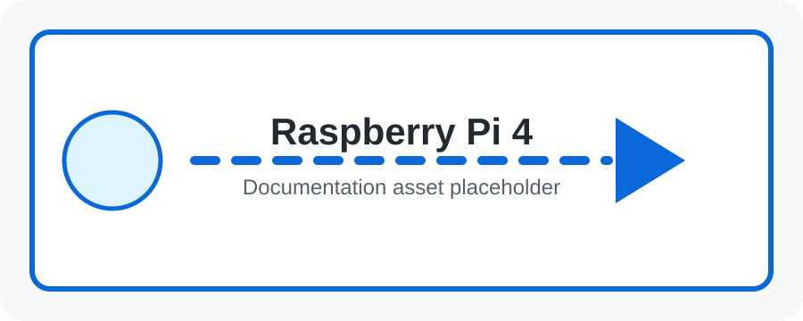

Raspberry Pi 4 remains popular for servers, automation, education, media, robotics, and IoT because of its strong ecosystem and broad accessory support.

**Raspberry Pi 4 Model B details:**

| Feature | Detail |
|---|---|
| Processor | Broadcom BCM2711 quad-core Cortex-A72 64-bit SoC, listed by Raspberry Pi at 1.8 GHz on current specs |
| Memory | 1 GB, 2 GB, 4 GB, or 8 GB LPDDR4 variants |
| Networking | Gigabit Ethernet, dual-band 802.11ac Wi-Fi, Bluetooth 5.0, BLE |
| USB | 2 × USB 3.0 and 2 × USB 2.0 |
| Display | 2 × micro-HDMI, up to dual 4K output depending on mode |
| Camera/display | MIPI CSI camera and MIPI DSI display connectors |
| GPIO | Standard 40-pin Raspberry Pi header |
| Storage | microSD card for OS and data |
| Power | USB-C supply; allow enough current for USB peripherals |

Use Pi 4 when you need a capable Linux computer for dashboards, MQTT brokers, Node-RED, Python automation, camera projects, local databases, or gateway services.

### 🔹 15.3 Raspberry Pi Zero

Raspberry Pi Zero boards are small Linux computers useful when size, cost, and power are important. They suit compact networked projects and lightweight gateways.

### 🔹 15.4 Raspberry Pi Compute Module


Compute Modules are designed for product integration on custom carrier boards. They are used in industrial, commercial, kiosk, signage, and embedded Linux products.

Compute Module families expose Raspberry Pi compute capability in a compact module format so product designers can choose their own connectors, power design, Ethernet, USB layout, storage, and enclosure. Compute Module 4 is based on Raspberry Pi 4-class silicon, while Compute Module 5 brings Raspberry Pi 5-class performance, ECC-capable memory options, optional eMMC, and richer high-speed interfaces for industrial IoT and edge products.

### 🔹 15.5 Raspberry Pi Pico

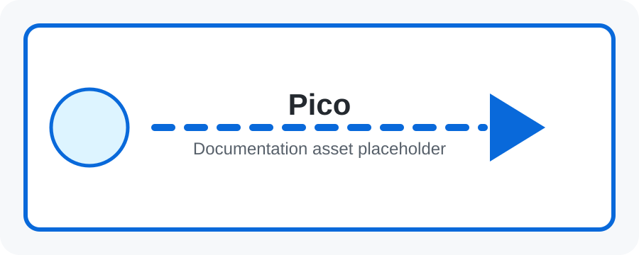

Raspberry Pi Pico is a microcontroller board based on RP2040 or RP2350-class devices, depending on model. It runs firmware rather than Linux and is programmed with C/C++, MicroPython, or similar tools.

**Raspberry Pi Pico / Pico W details:**

| Feature | Pico / Pico W family detail |
|---|---|
| MCU | RP2040 on Pico/Pico W |
| CPU | Dual-core Arm Cortex-M0+ up to 133 MHz |
| RAM | 264 KB on-chip SRAM |
| Flash | 2 MB onboard QSPI flash on common Pico boards |
| GPIO | 26 multifunction GPIO pins, including analog-capable inputs |
| Peripherals | UART, SPI, I²C, PWM, ADC, timers, PIO state machines |
| Wireless | Pico W/WH add 2.4 GHz 802.11n Wi-Fi and Bluetooth 5.2 capability |
| Programming | Drag-and-drop UF2 over USB, C/C++ SDK, MicroPython |

**Raspberry Pi Pico 2 / Pico 2 W details:**

| Feature | Pico 2 family detail |
|---|---|
| MCU | RP2350 family |
| CPU | Dual Arm Cortex-M33 or dual Hazard3 RISC-V processors at 150 MHz |
| RAM | 520 KB on-chip SRAM |
| Wireless | Pico 2 W adds 2.4 GHz 802.11n Wi-Fi and Bluetooth 5.2 |
| Compatibility | Designed to be software- and hardware-compatible with Pico 1 for many projects |

Use Pico when you need deterministic microcontroller behavior, fast GPIO, PWM, ADC, PIO-generated protocols, low cost, and direct hardware control without Linux.

### 🔹 16.1 Linux

Linux provides multitasking, filesystems, networking, permissions, package management, drivers, services, logs, and process isolation for Raspberry Pi applications.

### 🔹 16.2 Terminal

Terminal commands such as `pwd`, `cd`, `ls`, `mkdir`, `cp`, `mv`, `rm`, `sudo`, `apt`, `ssh`, `curl`, and `python3` are essential for setup, deployment, and debugging.

### 🔹 16.3 Python

Python is excellent on Raspberry Pi for GPIO control, web APIs, data logging, MQTT clients, dashboards, and automation.

```python
from gpiozero import LED
from time import sleep
led = LED(17)
while True:
    led.toggle()
    sleep(1)
```

### 🔹 16.4 GPIO Libraries

Common GPIO approaches include gpiozero for beginners, RPi.GPIO for legacy examples, pigpio for advanced timing, and libgpiod for modern Linux GPIO character-device workflows.

### 🔹 16.5 Bash

Bash scripts automate setup, service start, backups, deployments, and diagnostics.

```bash
#!/bin/bash
echo "IoT Gateway Started"
```

### 🔹 16.6 Networking

Networking tools include `ip addr`, `ping`, `ssh`, `scp`, `curl`, `hostname`, `nmcli`, and service logs. IoT gateways need stable addressing, DNS, security updates, and firewall awareness.

### 🔹 17.1 What is IoT?

IoT, or Internet of Things, describes physical devices that sense, process, communicate, and act. Examples include smart lights, locks, agriculture sensors, industrial monitoring, wearables, and environmental stations.

### 🔹 17.2 IoT Architecture

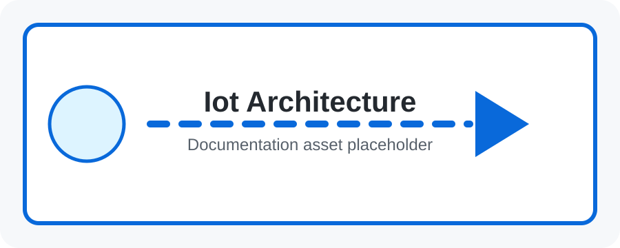

A typical architecture is device → network → broker/API → processing → database → dashboard/mobile app → user/action.

### 🔹 17.3 IoT Devices

An IoT device usually contains MCU/CPU, sensors, actuators, connectivity, firmware, power management, identity, storage, and security features. Good devices handle failures, reconnects, and firmware updates.

### 🔹 17.4 Sensors

Sensors measure temperature, humidity, distance, light, pressure, motion, acceleration, gas, current, voltage, and location. Choose sensors based on range, accuracy, interface, power, calibration, and environment.

### 🔹 17.5 Actuators

Actuators create physical action: LEDs emit light, motors rotate, servos position, relays switch loads, buzzers make sound, solenoids move linearly, and displays communicate information.

### 🔹 18.1 Firmware

Firmware is software compiled and loaded into embedded hardware. It configures peripherals, reads sensors, controls outputs, handles communication, stores settings, and recovers from errors.

### 🔹 18.2 Drivers

Drivers translate high-level code into device-specific operations. A sensor driver may initialize registers, start conversions, read bytes over I²C/SPI, convert raw values, and report engineering units.

### 🔹 18.3 Libraries

Libraries provide reusable abstractions for displays, sensors, motors, MQTT, HTTP, JSON, filesystems, and device protocols. They accelerate projects but should be chosen with memory, license, and maintenance in mind.

### 🔹 18.4 Arduino IDE

Arduino IDE is a beginner-friendly firmware workflow for boards and libraries. It is useful for quick experiments and teaching, while advanced projects may later move to PlatformIO, ESP-IDF, CMake, or vendor SDKs.

---

## 🌐 PART V — IoT

### 🔹 18.5 ESP-IDF

ESP-IDF is Espressif's official framework. It includes FreeRTOS, networking, drivers, build tools, partition tables, security features, flash tools, logging, configuration, and examples.

### 🔹 18.6 Python

Python is useful on Raspberry Pi gateways and servers for reading serial data, publishing MQTT, serving dashboards, storing data, processing images, and automating Linux tasks.

### 🔹 19.1 Wi-Fi

Wi-Fi links IoT devices to routers and the Internet. Plan for credentials, provisioning, reconnection, signal strength, power draw, network segmentation, and security updates.

### 🔹 19.2 HTTP

HTTP is request/response communication used by web pages and APIs. IoT devices can send `GET`, `POST`, `PUT`, or `DELETE` requests to servers or expose a local web server.

### 🔹 19.3 REST APIs

REST APIs model devices, readings, settings, and commands as HTTP resources. JSON payloads are common. Design APIs with authentication, validation, versioning, rate limits, and clear error responses.

### 🔹 19.4 MQTT

MQTT uses clients, a broker, topics, and publish/subscribe messaging. It is lightweight and well suited for telemetry. Example topic: `home/room1/temperature`; example payload: `{ "temperature": 27.4 }`.

### 🔹 19.5 WebSockets

WebSockets provide persistent two-way communication. They are useful for live dashboards, real-time control panels, streaming sensor data, and browser-based device interfaces.

### 🔹 19.6 TCP/IP

TCP/IP is the layered foundation below HTTP, MQTT, SSH, DNS, TLS, and many IoT protocols. Understanding IP addresses, ports, DNS, TCP, UDP, routing, and TLS helps debug connected systems.

### 🔹 20.1 Cloud Computing

Cloud computing provides remote compute, storage, messaging, identity, dashboards, analytics, and fleet management. IoT cloud design must consider latency, cost, reliability, security, and data ownership.

### 🔹 20.2 IoT Servers

IoT servers handle authentication, device registration, API requests, MQTT brokers, ingestion, validation, rules, alerts, command queues, OTA metadata, and dashboards.

### 🔹 20.3 Databases

Databases store sensor readings, device metadata, events, alerts, and configuration. Time-series data often needs timestamp, device ID, measurement type, value, unit, and quality status.

### 🔹 20.4 Dashboards

Dashboards convert raw telemetry into human insight with cards, charts, maps, device status, alerts, and controls. Good dashboards show current value, history, health, and last-seen time.

### 🔹 20.5 Mobile Applications

Mobile apps display telemetry, send commands, configure Wi-Fi, manage users, receive alerts, and control actuators. They normally communicate with a backend API rather than directly with every device.

### 🚦 Project 1 — LED Blink

Hardware: Arduino UNO, built-in LED or external LED with 220 Ω resistor.

```cpp
void setup() { pinMode(LED_BUILTIN, OUTPUT); }
void loop() { digitalWrite(LED_BUILTIN, HIGH); delay(1000); digitalWrite(LED_BUILTIN, LOW); delay(1000); }
```

Goal: learn output pins, timing, upload workflow, and visual debugging.

### 🔘 Project 2 — Push Button

Hardware: button, Arduino, optional external resistor or internal pull-up.

```cpp
const int buttonPin = 2;
const int ledPin = 13;
void setup(){ pinMode(buttonPin, INPUT_PULLUP); pinMode(ledPin, OUTPUT); }
void loop(){ int state = digitalRead(buttonPin); digitalWrite(ledPin, state == LOW ? HIGH : LOW); }
```

Goal: learn digital input, pull-ups, and conditional logic.

### 🎛️ Project 3 — Potentiometer + ADC

Connect potentiometer ends to 5 V and GND, and wiper to A0.

```cpp
void setup(){ Serial.begin(9600); }
void loop(){ int value = analogRead(A0); Serial.println(value); delay(100); }
```

Goal: learn analog readings and serial debugging.

### 📏 Project 4 — Ultrasonic Distance Sensor

Use an HC-SR04-style sensor with trigger and echo pins. Level-shift echo when required for 3.3 V boards.

```cpp
const int trigPin = 9;
const int echoPin = 10;
void setup(){ Serial.begin(9600); pinMode(trigPin, OUTPUT); pinMode(echoPin, INPUT); }
void loop(){ digitalWrite(trigPin, LOW); delayMicroseconds(2); digitalWrite(trigPin, HIGH); delayMicroseconds(10); digitalWrite(trigPin, LOW); long duration = pulseIn(echoPin, HIGH); float distance = duration * 0.0343 / 2; Serial.println(distance); delay(500); }
```

### 🌡️ Project 5 — Temperature Sensor

Read an analog or digital temperature sensor, convert raw data to engineering units, and print results.

```cpp
const int sensorPin = A0;
void setup(){ Serial.begin(9600); }
void loop(){ int raw = analogRead(sensorPin); Serial.print("Raw ADC: "); Serial.println(raw); delay(1000); }
```

### ⚙️ Project 6 — Servo Motor

Power small servos carefully and use a shared ground for external supplies.

```cpp
#include <Servo.h>
Servo servo;
void setup(){ servo.attach(9); }
void loop(){ servo.write(0); delay(1000); servo.write(90); delay(1000); servo.write(180); delay(1000); }
```

### 🌐 Project 7 — ESP32 Web Server

Build a local web page hosted on the ESP32 that toggles an LED or displays sensor readings.

```text
Phone/Computer → Wi-Fi → ESP32 Web Server → GPIO
```

Goal: learn Wi-Fi connection, HTTP routes, and browser-based control.

### 📡 Project 8 — ESP32 IoT Sensor

Read a sensor on ESP32 and send data over Wi-Fi to a server. Add reconnect logic, timestamps, and error reporting.

```text
Sensor → ESP32 → Wi-Fi → Router → Internet → Server
```

### 📬 Project 9 — MQTT Sensor

Publish sensor values to an MQTT broker and subscribe from a dashboard.

```json
{ "temperature": 27.4, "humidity": 61 }
```

Use structured topics such as `home/room1/temperature` and include device identity where needed.

### 🍓 Project 10 — Raspberry Pi IoT Gateway

Use Raspberry Pi as a bridge between local devices and the cloud.

```text
Arduino ──UART────┐
ESP32 ──Wi-Fi─────┤
                  ▼
            Raspberry Pi → Internet → Cloud
```

The gateway can collect data, filter readings, store locally, convert protocols, host dashboards, and forward telemetry.

---

## 🛠️ PART VI — PRACTICAL PROJECTS


---

## 🧩 Arduino vs ESP32 vs Raspberry Pi

| Feature | Arduino UNO | ESP32 | Raspberry Pi |
|---|---|---|---|
| Type | Microcontroller | Microcontroller / SoC | SBC |
| Typical OS | None | None / RTOS | Linux |
| CPU architecture | 8-bit AVR | 32-bit Xtensa/RISC-V depending on variant | 64-bit capable SoC family |
| Clock | 16 MHz | Variant-dependent | GHz-class on modern boards |
| RAM | KB | Hundreds of KB+ and optional PSRAM | GB-class on modern boards |
| Wi-Fi | External module required | Built in on Wi-Fi variants | Built in on many models |
| Bluetooth | External module required | Available on supported variants | Built in on many models |
| ADC | Built in | Variant-dependent | External ADC required on typical computers |
| Real-time control | Excellent | Excellent | OS-dependent |
| Python | Limited | MicroPython possible | Excellent |
| Best use | Learning and control | Connected embedded devices | Linux gateways and applications |

---

## 🧠 When Should I Use Which?

- Use Arduino for simple hardware control, low power, real-time behavior, sensors, motors, servos, and beginner learning.
- Use ESP32 for Wi-Fi, Bluetooth, MQTT, HTTP APIs, wireless sensors, web servers, OTA updates, and connected products.
- Use Raspberry Pi for Linux, Python, cameras, AI, databases, dashboards, complex networking, and IoT gateways.

---

## 🔥 Hardware + Software — The Complete Picture

```text
PHYSICAL WORLD
      ↓
    SENSOR
      ↓
MICROCONTROLLER
      ↓
   FIRMWARE
      ↓
   NETWORK
      ↓
   BACKEND
      ↓
  DATABASE
      ↓
APPLICATION
      ↓
    USER
```

---

## 🗺️ Complete Learning Roadmap

```text
Electronics Basics
  ↓
Voltage / Current / Resistance
  ↓
Digital / Analog Signals
  ↓
GPIO → PWM → ADC → Communication
  ↓
Arduino → ESP32 → Raspberry Pi Pico
  ↓
UART / SPI / I²C / CAN
  ↓
Wi-Fi / Bluetooth
  ↓
MQTT / HTTP / WebSockets
  ↓
Cloud Backend / Database / Dashboard
  ↓
Raspberry Pi Gateway / Linux / Python
  ↓
Advanced IoT Systems
```

---

## 📖 Quick Glossary

| Term | Full Form | Meaning |
|---|---|---|
| MCU | Microcontroller Unit | Complete small computer on a chip |
| MPU | Microprocessor Unit | Primarily a processing unit |
| SBC | Single Board Computer | Complete computer on a board |
| CPU | Central Processing Unit | Executes instructions |
| RAM | Random Access Memory | Temporary working memory |
| ROM | Read-Only Memory | Non-volatile memory concept |
| GPIO | General Purpose Input/Output | Digital hardware pins |
| PWM | Pulse Width Modulation | Digital pulse-based control |
| ADC | Analog-to-Digital Converter | Analog to digital conversion |
| DAC | Digital-to-Analog Converter | Digital to analog conversion |
| UART | Universal Asynchronous Receiver/Transmitter | Serial communication |
| SPI | Serial Peripheral Interface | High-speed peripheral bus |
| I²C | Inter-Integrated Circuit | Two-wire peripheral bus |
| CAN | Controller Area Network | Robust multi-node bus |
| USB | Universal Serial Bus | General-purpose device interface |
| Wi-Fi | Wireless LAN | Wireless networking |
| BLE | Bluetooth Low Energy | Low-power wireless communication |
| IoT | Internet of Things | Connected physical devices |
| MQTT | Message Queuing Telemetry Transport | Lightweight publish/subscribe protocol |
| API | Application Programming Interface | Software communication interface |
| IDE | Integrated Development Environment | Software development environment |
| SDK | Software Development Kit | Development tools and libraries |
| SoC | System on Chip | Multiple computer functions integrated into one chip |
| RTOS | Real-Time Operating System | OS designed for predictable timing |

---

## 🔎 Specification Source Notes

Board specifications change by model revision and SKU, so verify exact details against official product pages before designing hardware. Useful official references include Raspberry Pi Pico/Pico 2 product pages, Raspberry Pi 4 Model B specifications, Raspberry Pi 5 specifications, Raspberry Pi Compute Module pages, and Espressif ESP8266/ESP32/ESP32-C-series documentation.
